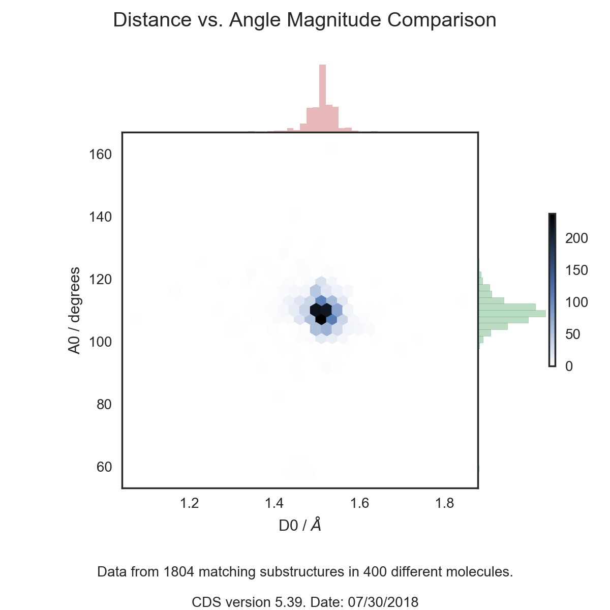

# pyX-Struct

Scrape Geometric X-ray Data from the [Cambridge Structural Database](https://www.ccdc.cam.ac.uk/solutions/csd-system/components/csd/)<sup>1</sup> 

## Getting Started 

The program is run from Terminal or Unix Shell in a python environment that
contains the Cambridge Crystallographic Data Centre library (CCDC). The program
may take in in a SMILES string along with additional optional arguments that 
can measure the distance between two atoms, an angle between three atoms, or a 
torsion angle between four atoms by searching the Cambridge Structural
Database of crystal structures (CSD) and may be used to graphically compare results.
If the measurement type and indices of the involved atoms are known, they
may be included in the initial command argument. If the indices are not known, the
types of measurement may still be specified. If no measurements are 
specified, the user will later be given the option to add measurements.
A structure search may still take place with no parameters. User has the 
option to export the data as a .CSV file which will save the resulting molecule's CSD identifier along with any specified substructure measurements. 
The program will then optionally search for hydrogen bonding from urea / thiourea nitrogens and 
save the count results as a CSV.
	
#### Package Dependencies
csd-python-api, future, matplotlib, numpy, pandas, seaborn

#### Optional Arguments
* A SMILES string (encased in quotations if illegal characters are involved) of a molecule will search for crystal structures including the substructure
* The `d` argument followed by two atom indices measures the distance between the two given atoms
* The `a` argument followed by three atom indices will measure an angle between the three given atoms
* The `t` argument followed by four atom indices will measure a torsion angle of the four given atoms
* The `s` argument will save the crystal identifiers and specified measurement search data as a .CSV file in the current directory
* The `lim` argument allows the user to specify a limit to the number of search results obtained, default limit is 1000 crystal structures
* The `p` argument will print search result data to the command line as the found crystal structure identifiers and specified measurements
* The `g` argument turns graphing of two measurements off, default behavior displays graph
* The `h` argument permits the search of urea or thiourea hydrogen bonding activity
	

## Sample Inputs/Outputs

#### Example 1: Search the CSD for a porphyrin ring substructure removing the search limit and exporting the results as a .CSV file
```
python structure_search.py 'C1=CC2=NC1=CC3=NC(=CC4=NC(=CC5=NC(=C2)C=C5)C=C4)C=C3' lim 0 s
Data will be saved.
Search for any specific measurements on this molecule? (y/n): n
Searching for substructures...
Found 18 matching substructures in 12 different molecules.
File saved to: ./search_16:38:39.CSV
```
Output file: [search_16:38:39.CSV](search_16:38:39.CSV)

#### Example 2: Search the CSD for a 2-chlorobut-2-ene substructure and measure a torsion angle
```
python structure_search.py 'CC=C(C)Cl' t 0 1 2 4 s
Torsion TOR0 added to the search.
Data will be saved.
Searching for substructures with a limit of 1000 max structures...
Found 2238 matching substructures in 1000 different molecules.
File saved to: ./search_16:42:05.CSV
```
Output file: [search_16:42:05.CSV](search_16:42:05.CSV)

#### Example 3: Search the CSD for an ethanol substructure measuring C-O distance and C-C-O angle
```
python structure_search.py 'CCO' d a lim 
0 QueryAtom(C)[atom aromaticity: equal to 0]
1 QueryAtom(C)[atom aromaticity: equal to 0]
2 QueryAtom(O)[atom aromaticity: equal to 0]
Enter two indices to measure a distance (# #): 0 1
Distance D0 added to the search.
0 QueryAtom(C)[atom aromaticity: equal to 0]
1 QueryAtom(C)[atom aromaticity: equal to 0]
2 QueryAtom(O)[atom aromaticity: equal to 0]
Enter three indices to measure an angle (# # #): 2 1 0
Angle A0 added to the search.
Enter a number for max number of hits for the search: 400
Searching for substructures with a limit of 400 max structures...
Found 1804 matching substructures in 400 different molecules.
Graphing 'D0' vs 'A0'...
```



  
## Known Bugs
* Unable to access indices of hydrogen atoms given a SMILES string.
* UserWarning occurs when generating the graph since 'normed' kwarg is depricated.
	
## Other Notes
* If a measurement is not specified or indices of a measurement are not given,
	interaction with the terminal is required.
* The default search limit is 1000 structures.
* If a measurement was added by accident and the program is asking for indices, entering `q` will quit adding the measurement.

#### References
1. “The Cambridge Structural Database” Groom, C. R.; Bruno, I. J.; Lightfoot, M. P.; Ward, S. C.; *Acta Cryst. B*, **2016**, *B72*, 171-179
[**DOI:** 10.1107/S2052520616003954](http://dx.doi.org/10.1107/S2052520616003954)

---
License: [CC-BY](https://creativecommons.org/licenses/by/3.0/)
